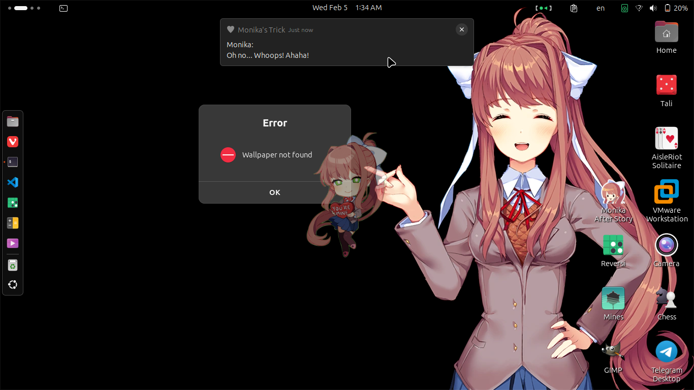
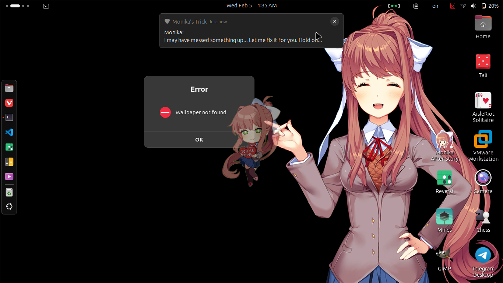
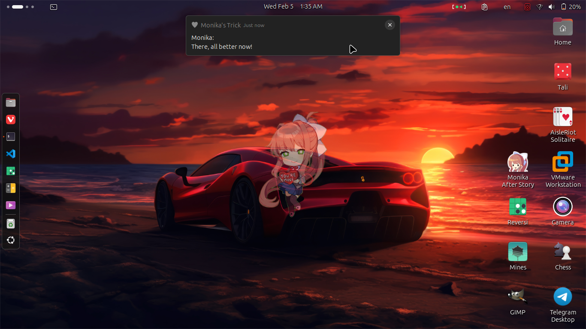

# Monika's Trick - A Wallpaper Prank

## 🎭 About the Project

**Monika's Trick** is a fun prank script that temporarily hijacks your wallpaper, replacing it with an image of Monika from *Doki Doki Literature Club!* pointing at an error message. After teasing you for a bit, she apologizes and restores your original wallpaper. 😆

This project was a simple Bash script. Now, it has evolved into a cross-platform Python prank that works on **Linux** and **Windows**!

## 🚨 Disclaimer

This is a fan work inspired by *Doki Doki Literature Club! (DDLC)* and is not affiliated with or endorsed by *Team Salvato.*
*DDLC* and all related characters are the intellectual property of Team Salvato. This project is intended as a lighthearted joke and respects the original work’s integrity.

## 🚀 Features

- **Cross-platform support** (Windows & Linux)
- **Smart wallpaper backup on Windows** (Prevents permanent changes)
- **Immersive Monika interactions**
- **Custom command-line options**
- **Multiple launchers** (Bash, Batch, PowerShell)
- **Easter eggs?** 😏

## :camera: ​Preview







------

## 🛠️ Installation & Usage​

### 🔧 Prerequisites

Make sure you have **Python 3** installed. Check with:

```sh
python3 --version  # Linux
python --version   # Windows
```

If you don't have Python installed, download it from [python.org](https://www.python.org/).

### 🏃 Running the Prank

Simply launch the script using the appropriate method for your OS:

#### Linux (Bash - `.sh`)

```sh
chmod +x run.sh  # (First time only)
./launch.sh
```

#### Windows (Command Prompt - `.bat`)

```sh
run.bat
```

#### Windows (PowerShell - `.ps1`)

```powershell
./run.ps1
```

#### Directly via Python

```sh
python3 main.py
```

### 📝 Command-Line Options

| Option                   | Description                                     |
| ------------------------ | ----------------------------------------------- |
| `-h`, `--help`           | Show help message & exit                        |
| `--about`                | Show about message & exit                       |
| `-v[N]`, `--verbose[=N]` | Increase verbosity (1=INFO, 2=WARNING, 3=DEBUG) |
| `--no-colored-log`       | Disable ANSI colors in log messages             |

------

## 🔍 How It Works

1. **Backs up your current wallpaper** (this is under Windows only to prevent permanent changes; on Linux, it just changes the wallpaper path).
2. **Replaces it with Monika’s special error image.**
3. **Monika “interacts” with you**, sending playful notifications.
4. **Restores your original wallpaper** after the prank ends.

> Note: On Windows, wallpapers are cached at `%APPDATA%\Microsoft\Windows\Themes\TranscodedWallpaper`, so the backup system ensures your wallpaper is safely restored!

------

## 👨‍💻 Development & Contribution

Want to improve Monika’s Trick? Feel free to contribute!

### 📂 To-Do List

- [ ] Add new payload wallpapers for different OS themes 🎨
- [x] Windows support!
- [ ] Make the prank even sneakier 😈
- [ ] MacOS support.

### 🤝 Contributing

1. Fork the repository 🍴
2. Create a new branch (`git checkout -b feature-new-thing`)
3. Commit changes (`git commit -m 'Added a cool feature'`)
4. Push to your branch (`git push origin feature-new-thing`)
5. Open a Pull Request! 🎉

------

## 🏆 Credits

**Author:**

- CH3CKMATE-2002

**Contributors:**
- My best friend, Hani 💪 (Windows testing)
- Monika (because she refuses to be removed 😆)


🛑 ⚠️ *This project is meant for fun! No actual system harm is done, and everything is restored at the end.* ⚠️ 🛑

🔗 *Inspired by the legendary Monika from DDLC!* 💚
